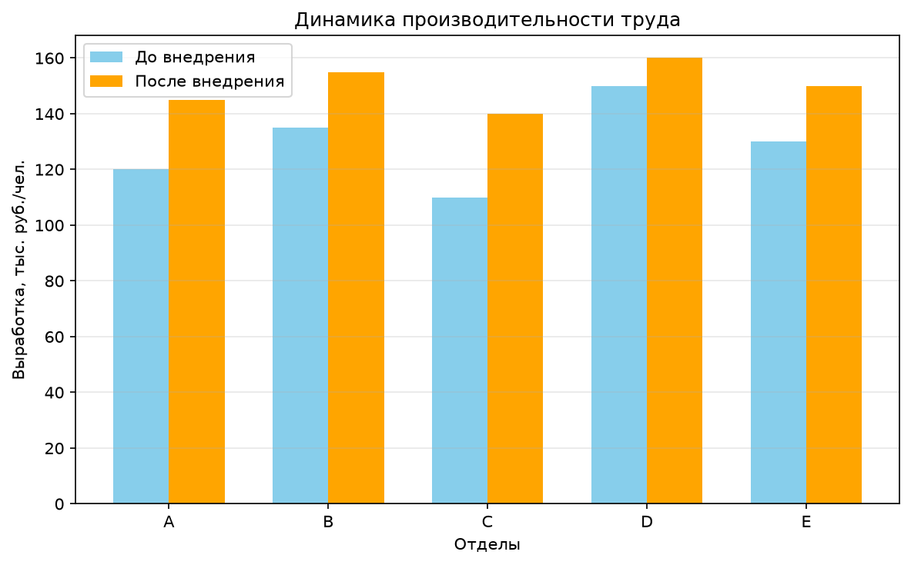

# ОЦЕНКА ВЛИЯНИЯ АВТОМАТИЗАЦИИ НА ПРОИЗВОДИТЕЛЬНОСТЬ ТРУДА: РЕШЕНИЕ ЗАДАЧИ ПО ДЕЙСТВИЯМ

## Задача:

Оценить влияние внедрения ERP-системы на производительность труда в компании.
Даны данные по $5$ отделам за $2$ года (до и после внедрения). Оценить, изменилась ли
средняя выработка на сотрудника статистически значимо.

---

## Действие 1. Подготовка исходных данных

Собираем и структурируем данные по $5$ отделам компании.

**Исходные данные по отделам:**

| Параметр ($обозначение$), единица измерения | Значение |
|---|---|
| Выработка отдела A до внедрения ($x_A$), тыс. руб./чел. | $120$ |
| Выработка отдела B до внедрения ($x_B$), тыс. руб./чел. | $135$ |
| Выработка отдела C до внедрения ($x_C$), тыс. руб./чел. | $110$ |
| Выработка отдела D до внедрения ($x_D$), тыс. руб./чел. | $150$ |
| Выработка отдела E до внедрения ($x_E$), тыс. руб./чел. | $130$ |
| Выработка отдела A после внедрения ($y_A$), тыс. руб./чел. | $145$ |
| Выработка отдела B после внедрения ($y_B$), тыс. руб./чел. | $155$ |
| Выработка отдела C после внедрения ($y_C$), тыс. руб./чел. | $140$ |
| Выработка отдела D после внедрения ($y_D$), тыс. руб./чел. | $160$ |
| Выработка отдела E после внедрения ($y_E$), тыс. руб./чел. | $150$ |
| Число отделов ($n$), шт. | $5$ |

$x_i$ — выработка $i$-го отдела до внедрения ($i \in \{A, B, C, D, E\}$)

$y_i$ — выработка $i$-го отдела после внедрения ($i \in \{A, B, C, D, E\}$)

---

## Действие 2. Расчет изменений по каждому отделу

*Абсолютный прирост* (на сколько единиц изменилась выработка $i$-го отдела):

$d_i = y_i - x_i$

*Относительный прирост* (на сколько процентов изменилась выработка $i$-го отдела):

$g_i = \frac{d_i}{x_i} \cdot 100％$

---

**Числовой расчёт по каждому отделу:**

**Отдел A.**

$d_A = 145 - 120 = 25$

$g_A = \frac{25}{120} \cdot 100％ = 20,83％$

**Отдел B.**

$d_B = 155 - 135 = 20$

$g_B = \frac{20}{135} \cdot 100％ = 14,81％$

**Отдел C.**

$d_C = 140 - 110 = 30$

$g_C = \frac{30}{110} \cdot 100％ = 27,27％$

**Отдел D.**

$d_D = 160 - 150 = 10$

$g_D = \frac{10}{150} \cdot 100％ = 6,67％$

**Отдел E.**

$d_E = 150 - 130 = 20$

$g_E = \frac{20}{130} \cdot 100％ = 15,38％$

**Результаты расчёта по отделам:**

| Отдел | Абсолютный прирост ($d_i$), тыс. руб./чел. | Относительный прирост ($g_i$), % | Примечание |
|-------|--------------------|---------------------------|------------|
| A | $+25$ | $20{,83}$ | |
| B | $+20$ | $14{,81}$ | |
| C | $+30$ | $27{,27}$ | Максимальный рост |
| D | $+10$ | $6{,67}$ | Минимальный рост |
| E | $+20$ | $15{,38}$ | |

---

## Действие 3. Расчет средних значений

*Средняя выработка до внедрения* (среднее арифметическое значений $x_i$):

$\bar{x} = \frac{\sum x_i}{n}$

*Средняя выработка после внедрения* (среднее арифметическое значений $y_i$):

$\bar{y} = \frac{\sum y_i}{n}$

*Абсолютный прирост средних* (разница между средними значениями после и до внедрения):

$\bar{d} = \bar{y} - \bar{x}$

*Относительный прирост средних* (на сколько процентов изменилась средняя выработка):

$g = \frac{\bar{d}}{\bar{x}} \cdot 100％$

---

**Числовой расчёт средних:**

$\bar{x} = \frac{120 + 135 + 110 + 150 + 130}{5} = 129$

$\bar{y} = \frac{145 + 155 + 140 + 160 + 150}{5} = 150$

$g = \frac{21}{129} \cdot 100％ = 16,28％$

---

**Средние значения показателей:**

| Средняя выработка до внедрения ($\bar{x}$), тыс. руб./чел. | Средняя выработка после внедрения ($\bar{y}$), тыс. руб./чел. | Абсолютный прирост средних ($\bar{d}$), тыс. руб./чел. | Относительный прирост средних ($g$), % |
|---|---|---|---|
| $129$ | $150$ | $+21$ | $16{,28}$ |

---

## Действие 4. Статистическая проверка гипотезы (парный t-критерий Стьюдента)

Проверяем, является ли наблюдаемый рост производительности статистически значимым
или это случайность. Парный t-критерий применяется, потому что сравниваются одни и те же
отделы в двух состояниях (до и после) — это зависимые (парные) выборки.
В расчёте используется разница по каждому отделу $d_i = y_i - x_i$ (значение после минус значение до);
её числовые значения уже приведены в Действии $2$ (таблица «Абсолютный прирост»).

**Гипотезы:**

$H_0$ — нулевая гипотеза (разница между показателями равна нулю, внедрение ERP не повлияло)

$H_1$ — альтернативная гипотеза (разница не равна нулю, внедрение ERP повлияло)

---

**Пошаговый расчет t-статистики:**

**Шаг $1$.**

Вычисляем среднюю разницу как среднее арифметическое всех разниц.

*Общая формула средней разницы* (среднее арифметическое всех разниц; совпадает с абсолютным приростом средних $\bar{d}$ из Действия 3):

$\bar{d} = \frac{\sum d_i}{n}$

---

**Числовой расчёт средней разницы:**

$\bar{d} = \frac{25 + 20 + 30 + 10 + 20}{5} = \frac{105}{5} = 21$

---

**Шаг $2$.**

Находим отклонения каждой разницы от средней и их квадраты.

*Общая формула отклонения* $e_i$ (насколько значение разницы отличается от средней разницы):

$e_i = d_i - \bar{d}$

*Общая формула квадрата отклонения* $e_i^2$ (квадрат отклонения значения от средней разницы):

$e_i^2 = (d_i - \bar{d})^2$

---

**Числовой расчёт по каждому отделу:**

**Отдел A.**

$d_A - \bar{d} = 25 - 21 = 4$

$(d_A - \bar{d})^2 = 4^2 = 16$

**Отдел B.**

$d_B - \bar{d} = 20 - 21 = -1$

$(d_B - \bar{d})^2 = (-1)^2 = 1$

**Отдел C.**

$d_C - \bar{d} = 30 - 21 = 9$

$(d_C - \bar{d})^2 = 9^2 = 81$

**Отдел D.**

$d_D - \bar{d} = 10 - 21 = -11$

$(d_D - \bar{d})^2 = (-11)^2 = 121$

**Отдел E.**

$d_E - \bar{d} = 20 - 21 = -1$

$(d_E - \bar{d})^2 = (-1)^2 = 1$

---

**Промежуточные расчёты по отделам:**

| Отдел | Абсолютный прирост ($d_i$), тыс. руб./чел. | Отклонение ($e_i$), тыс. руб./чел. | Квадрат отклонения ($e_i^2$), (тыс. руб./чел.)² |
|-------|---|-------|----------|
| A | $25$ | $4$ | $16$ |
| B | $20$ | $-1$ | $1$ |
| C | $30$ | $9$ | $81$ |
| D | $10$ | $-11$ | $121$ |
| E | $20$ | $-1$ | $1$ |
| Сумма | $105$ | $0$ | $220$ |

---

**Шаг $3$.**

Вычисляем дисперсию разниц как средний квадрат отклонений разниц от средней.

*Общая формула дисперсии разниц* (средний квадрат отклонений разниц от средней):

$s_d^2 = \frac{\sum (d_i - \bar{d})^2}{n - 1}$

---

**Числовой расчёт дисперсии:**

$s_d^2 = \frac{16 + 1 + 81 + 121 + 1}{5 - 1} = \frac{220}{4} = 55$

---

**Шаг $4$.**

Вычисляем стандартное отклонение разниц как корень из дисперсии.

*Общая формула стандартного отклонения* (корень из дисперсии):

$s_d = \sqrt{s_d^2}$

---

**Числовой расчёт стандартного отклонения:**

$s_d = \sqrt{55} \approx 7,416$

---

**Шаг $5$.**

Вычисляем стандартную ошибку средней разницы как отношение стандартного отклонения к корню из числа наблюдений.

*Общая формула стандартной ошибки* (отношение стандартного отклонения к корню из числа наблюдений):

$SE_{\bar{d}} = \frac{s_d}{\sqrt{n}}$

---

**Числовой расчёт стандартной ошибки:**

$SE_{\bar{d}} = \frac{s_d}{\sqrt{n}} = \frac{7,416}{\sqrt{5}} = \frac{7,416}{2,236} \approx 3,317$

---

**Шаг $6$.**

Находим t-статистику как отношение средней разницы к её стандартной ошибке.

*Общая формула t-статистики* (отношение средней разницы к её стандартной ошибке):

$t = \frac{\bar{d}}{SE_{\bar{d}}}$

---

**Числовой расчёт t-статистики:**

$t = \frac{21}{3,317} = 6,3317$

---

**Шаг $7$.**

Определяем p-value и число степеней свободы.

*p-value* (вероятность получить наблюдаемые или более экстремальные результаты при условии, что нулевая гипотеза $H_0$ верна):

$p = P\left(|t| \geq t_{\text{obs}} \mid H_0\right)$

*Общая формула числа степеней свободы* (число наблюдений минус единица):

$df = n - 1$

---

**Числовой расчёт числа степеней свободы и p-value:**

$df = 5 - 1 = 4$

$p = 0\text{,}0032$ ($0\text{,}32％$)

Значение $p$ определяется по таблице критических значений t-распределения Стьюдента для $df = 4$: при $t = 4\text{,}604$ имеем $p = 0\text{,}01$, при $t = 7\text{,}173$ имеем $p = 0\text{,}002$. Наблюдаемое $t = 6\text{,}3317$ лежит между этими значениями, поэтому $p \approx 0\text{,}0032$, то есть $0\text{,}32％$.

Полученное значение означает: если бы внедрение ERP-системы в действительности не влияло на выработку (гипотеза $H_0$ верна), вероятность случайно получить наблюдаемый рост составила бы лишь $0\text{,}32％$. 


**Итоговые статистики:**

| t-статистика ($t$) | Число степеней свободы ($df$) | p-value |
|---|---|---|
| $6{,3317}$ | $4$ | $0{,0032}$ ($0{,32}％$) |

---

## Действие 5. Интерпретация результатов

Сравниваем p-value с уровнем значимости $\alpha = 0\text{,}05$ ($5％$).

**Правило принятия решения:**

| Условие | Решение |
|---------|---------|
| p-value $< 0\text{,}05$ | отвергаем $H_0$ — результат статистически значим |
| p-value $\geq 0\text{,}05$ | не отвергаем $H_0$ — результат не значим |

В нашем случае $p = 0\text{,}0032 < \alpha = 0\text{,}05$, поэтому нулевая гипотеза $H_0$ **отвергается** в пользу альтернативной $H_1$. Рост производительности труда после
внедрения ERP-системы является **статистически значимым** с вероятностью ошибки менее $1％$ (точнее — $0{,32}％$).

---

## Действие 6. Дополнительная медианная оценка

Медиана — значение, делящее упорядоченный набор данных на две равные половины.
В отличие от среднего, медиана устойчива к выбросам.

**Сравнение показателей до и после внедрения:**

| Этап | До внедрения ($x_i$), тыс. руб./чел. | После внедрения ($y_i$), тыс. руб./чел. |
|------|--------------|-----------------|
| Исходные значения | $120$, $135$, $110$, $150$, $130$ | $145$, $155$, $140$, $160$, $150$ |
| Упорядочено по возрастанию | $110$, $120$, $130$, $135$, $150$ | $140$, $145$, $150$, $155$, $160$ |
| Медиана (3-е значение) | $130$ | $150$ |

**Итоговая медианная оценка:**

| Медиана до внедрения, тыс. руб./чел. | Медиана после внедрения, тыс. руб./чел. | Медианный прирост, тыс. руб./чел. |
|---|---|---|
| $130$ | $150$ | $+20$ |

Близость средних и медианных значений говорит о равномерности данных без сильных
выбросов; оба показателя подтверждают рост производительности.

---

## Действие 7. Визуализация

Строится столбчатая диаграмма: синие столбцы — выработка до внедрения, оранжевые — после.
Диаграмма наглядно демонстрирует рост производительности по каждому отделу.



*Рисунок 1. Выработка на сотрудника по отделам до и после внедрения ERP-системы.*

---

## Итоговое заключение

Средняя выработка на сотрудника выросла со $129$ до **$150$** тыс. руб./чел. Абсолютный прирост составил **$+21$** тыс. руб./чел., относительный — **$+16\text{,}28％$**.

Статистическая проверка подтвердила значимость роста производительности: $t$ = **$6\text{,}3317$**; $df = 4$; p-value = **$0\text{,}0032$** (меньше уровня значимости $0\text{,}05$).

**Вывод:** рост производительности труда статистически значим; внедрение ERP-системы действительно повысило выработку. Результаты подтверждают эффективность автоматизации и служат основанием для дальнейшей цифровизации компании.

---

## Запуск решения в виде программы

```bash
pip install -r ../requirements.txt
python solution_task1.py
```

> Ожидаемый вывод программы — см. [`expected_output.txt`](./expected_output.txt).